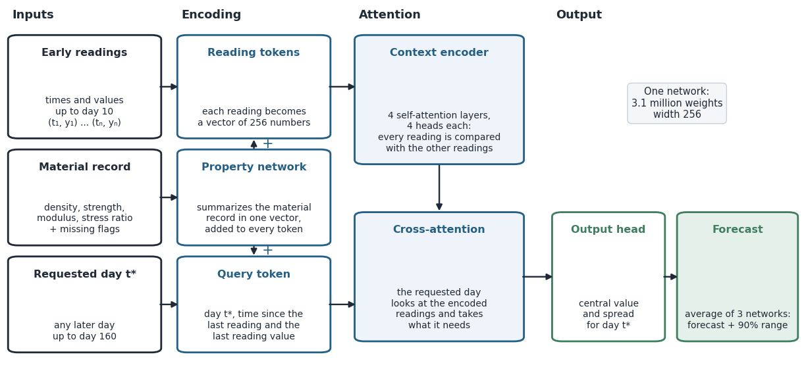
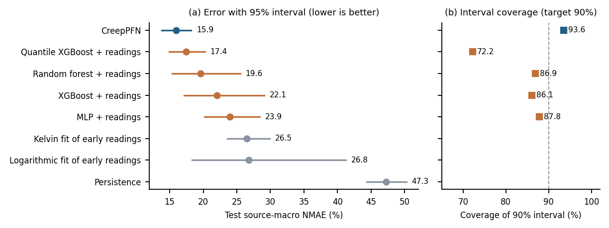
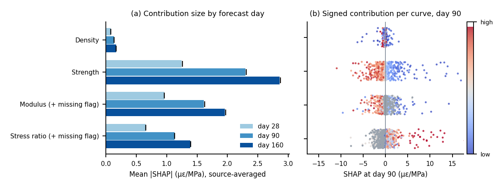

# CreepPFN model card

## Model summary

CreepPFN is a transformer-based prior-data fitted network that forecasts the creep compliance of concrete, together with a 90% range, from density, compressive strength, the 28-day modulus, the stress ratio and the readings of the first ten days of a creep test. Because measured creep curves are too few and too unevenly spread to train a model that generalizes to new laboratories, the network is first trained on synthetic creep tests drawn from a hierarchical Bayesian model of past tests and is then fine-tuned on measured curves.

In each source-disjoint fold, the hierarchical Bayesian model is fitted by Hamiltonian Monte Carlo to all readings of the training curves. It describes a typical curve for given material properties and separates the variation between literature sources, between specimens and between readings, so that the synthetic tests follow the distribution of real tests rather than an assumed one. Each curve follows the Kelvin4 family, a sum of three Kelvin terms with retardation times of 0.3, 3 and 30 days and one logarithmic term, and a discrepancy term calibrated on validation sources widens the synthetic curves with forecast distance. The 15 networks of the five folds were trained on 1,230,000 synthetic tests in total.

## Inputs

| Input | Unit | Requirement |
|---|---:|---|
| Density, ρ | kg/m³ | Positive value |
| Compressive strength, f_c | MPa | Positive value |
| Recorded 28-day elastic modulus, E28 | MPa | Positive value or missing |
| Stress ratio, applied stress / strength at loading | – | Between 0 and 1, or missing |
| Early elapsed times | days since loading | At least two, strictly increasing, up to day 10 |
| Early compliance readings | microstrain/MPa | One value at each early time |
| Query times | days since loading | After day 10 and no later than day 160 |

The first reading is the anchor, and the model predicts the compliance increase after it. Missing modulus or stress-ratio values are flagged and replaced by training medians.

## Architecture

Each early reading becomes a token to which a summary of the material record is added, and a context encoder with four self-attention layers relates the readings to one another. For each requested day, cross-attention takes the relevant information from the encoded readings, and an output head returns a central value and a spread. Each network has 3.1 million weights, and three networks trained with different seeds are averaged, with the 90% range taken from their combined distribution.

## Evidence

On 610 curves from 65 literature sources of the NU database that were withheld from training, CreepPFN had the lowest error of all models tested under the same protocol, with a source-averaged normalized mean absolute error of 15.94% (95% interval 13.78–18.22%). It was significantly more accurate than gradient boosting, a neural network and curve fitting of the early readings, and comparable to quantile gradient boosting and a random forest. It was the only model whose 90% range kept its nominal coverage on unseen sources, at 93.6% against 72.2–87.8% for the baselines. Forecast error fell from 25.40% with three days of readings to 17.20% with ten days and 9.58% with 28 days. On external curves, the error was 11.08% for 47 KMUTT laboratory curves and 21.90% for 19 literature curves, where the probable recycled-aggregate concrete curves were poorly forecast.

A SHAP analysis with each specimen's readings held fixed showed that higher strength and modulus lower the forecast creep and that a higher stress ratio raises it, in line with Eurocode 2 and the fib Model Code 2010. These attributions describe model behaviour, not causal material effects.

## Intended use and limits

CreepPFN is a research tool for forecasting laboratory creep compliance from a short test and for planning test duration. It is evaluated only up to day 160 and does not use humidity, mixture composition, loading age, stress history or specimen geometry. Its output is not constrained to increase monotonically, its 90% range applies at each day separately rather than to the whole curve, and it has not been shown to handle concretes that are rare in the training data, such as recycled-aggregate concrete. The test sources had been examined in earlier studies, so the reported accuracy is exploratory. The model does not replace creep testing, constitutive assessment or structural engineering review.
