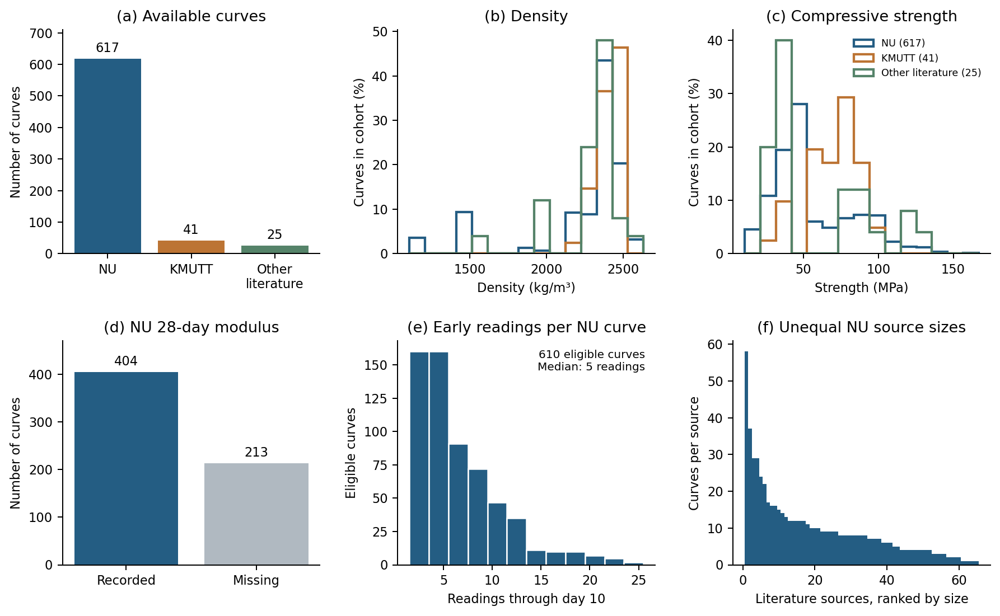
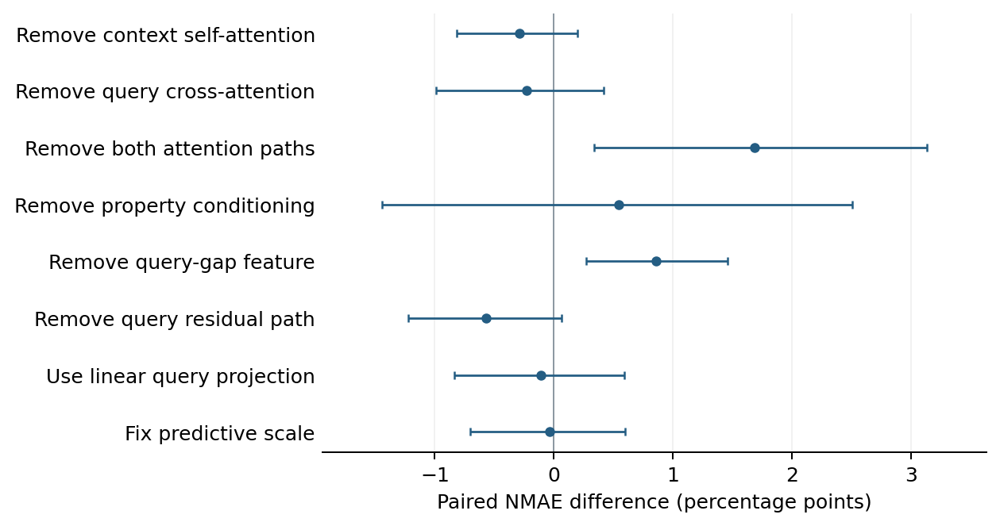
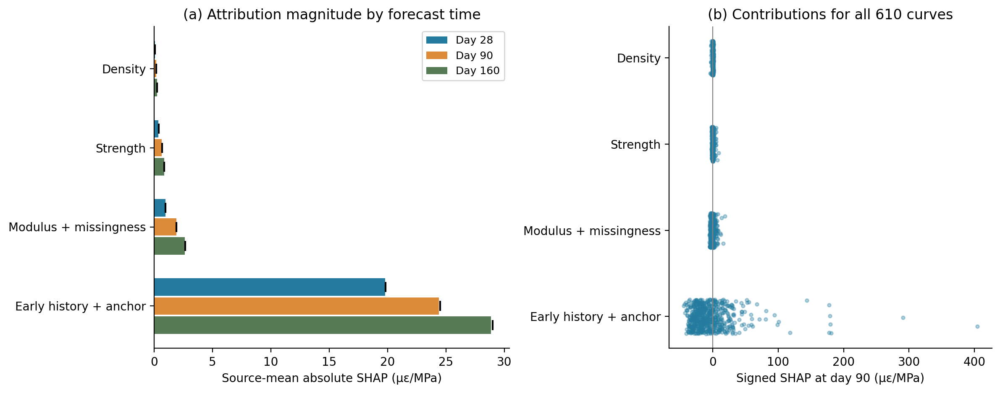
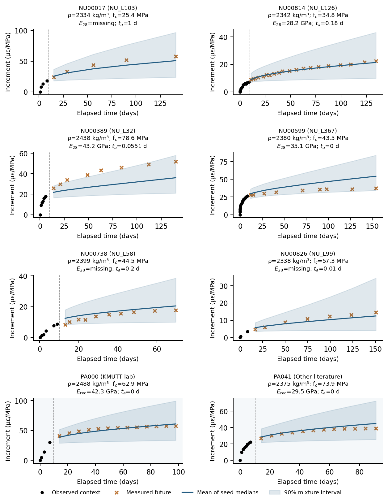

# CreepPFN model card

## Model summary

CreepPFN is a material-conditioned prior-data fitted network for concrete creep
forecasting. It predicts later compliance from a short, irregular sequence of
early measurements. The model combines a synthetic task generator, an
attention-based predictor, and real-curve fine-tuning.

The figure summarizes two phases. During learning, real training-source curves
calibrate a material-linked generator. Generated tasks expose the network to
varied curve shapes and observation schedules. Measured training curves then
fine-tune the network. During application, frozen weights process one new
specimen's material descriptors, early readings, and requested future times.

## Inputs

| Input | Unit | Requirement |
|---|---:|---|
| Density, $\rho$ | kg/m³ | Positive value |
| Compressive strength, $f_c$ | MPa | Positive value |
| Recorded 28-day elastic modulus, $E_{28}$ | MPa | Positive value or missing |
| Early elapsed times | days since loading | At least two, strictly increasing, through day 10 |
| Early compliance readings | microstrain/MPa | One value at each early time |
| Query times | days since loading | After day 10 and no later than day 160 |

The first recorded time is the **anchor**. Its compliance defines the zero
reference for the response increment. For readings on days 1, 3, and 7, the
early history contains those three time-response pairs and the anchor is day 1.
A measurement exactly on day 10 is not required.

## Architecture

Each early time-response pair becomes a context token. A property network encodes
density, strength, modulus, modulus missingness, and first-reading time. Four
self-attention layers relate early readings to one another. Each future query
then cross-attends to the encoded history. The query includes its elapsed time
and gap from the last context observation. The selected model has width 256,
four layers, four attention heads, feed-forward width 768, and 3,099,906
trainable parameters per member.

Each member predicts a central response and uncertainty scale. A paper fold
ensemble averages three member medians. Its central 90% interval is calculated
from their predictive mixture. The application can also pool all 15 members.
That pooled option is an exploratory deployment ensemble and is not the unit used
to calculate the paper's cross-validation metric.

## Training data and leakage controls

The NU cohort contains 617 imported curves in 65 literature-source groups. Of
these, 610 curves have at least two readings through day 10 and at least one later
reading through day 160. The evaluated target contains 5,646 later readings.

Five outer folds separate complete literature sources. Within each fold:

1. only training sources fit the scaler, missing-modulus imputation, and curve generator;
2. synthetic pretraining samples tasks from that training-only generator;
3. real fine-tuning uses only training-source curves;
4. validation sources select hyperparameters and checkpoints; and
5. outer-test sources are reserved for evaluation.

Later test responses never enter the application input. Synthetic tasks increase
training variety, but do not create independent experiments or remove distribution shift.

## Reported evidence

The revised five-fold ensembles attained **17.40% source-macro NMAE**, with a
95% source-bootstrap interval of **14.96–20.14%**. The corresponding source-macro
MAE was 6.53 microstrain/MPa. Aggregate coverage of the nominal 90% marginal
interval was 94.51%, with mean width 31.73 microstrain/MPa.

These estimates are conditional on the reported source definitions, cohort,
training seeds, model-selection procedure, and 160-day task. The revised
architecture was chosen after earlier inspection of the same outer partitions.
The result is therefore a post-selection reassessment rather than new independent
confirmation.

## Architecture evidence

Removing both attention paths increased source-macro NMAE by 1.69 percentage
points, with a paired 95% source-bootstrap interval of 0.34–3.13 points. Removing
the query-gap feature increased it by 0.86 points (0.27–1.46). Intervals for six
other removals included zero. These exploratory comparisons are unadjusted for
multiple testing. Attention removal also changes parameter count, so it does not
isolate attention from model capacity.

## Model attribution

At day 90, the source-weighted absolute attribution shares were 89.97% for early
history plus anchor, 6.99% for modulus plus missingness, 2.40% for strength, and
0.64% for density. Early history contains several times and responses, whereas
density and strength are single descriptors. The group magnitudes are therefore
not equal-sized comparisons of physical variables. SHAP explains model outputs
relative to the chosen background; it does not establish causal material effects,
prediction accuracy, or explained variance.

## Example forecasts

Black points show the measured early context. Orange crosses are later measured
values reserved for evaluation. The blue line is the mean of member medians, and
the shaded region is the central 90% marginal predictive interval. The displayed
examples do not replace cohort-level evaluation.

## Intended use

The model supports research on early-to-later concrete creep forecasting and can
help explore measurement schedules or candidate future responses. Appropriate use
requires the same input definitions and units as the training protocol. New
material classes, laboratories, or response conversions require independent
validation.

## Limitations and out-of-scope uses

- The validated forecast horizon ends at day 160.
- The model does not represent unloading, cyclic loading, changing environments,
  accelerating tertiary creep, or arbitrary stress histories.
- Humidity, mixture composition, loading age, stress, geometry, and curing
  conditions are not explicit application inputs.
- Output trajectories are not constrained to be monotonic or nonnegative.
- Predictive intervals are marginal at each time, not simultaneous bounds for a
  complete trajectory.
- Aggregate interval coverage does not establish calibration for every material,
  source, or horizon.
- The app does not calculate structural deformation or verify structural safety.

CreepPFN is a research model. It does not replace creep testing, constitutive
assessment, code compliance, or review by a qualified structural engineer.
