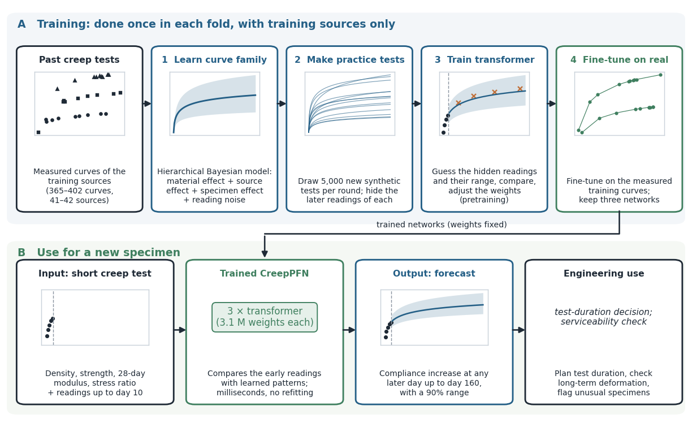

# CreepPFN

CreepPFN forecasts the creep compliance of concrete, with a 90% range, from basic material properties and the readings of the first ten days of a creep test. It is a transformer-based prior-data fitted network that is first trained on synthetic creep tests drawn from a hierarchical Bayesian model of past tests and then fine-tuned on measured curves, which lets it generalize to laboratories it has never seen. This repository accompanies the paper *CreepPFN: Forecasting Concrete Creep with a Transformer Trained on a Hierarchical Bayesian Prior* and provides the trained networks, a command-line tool, a Gradio app, the training code and the scripts behind the paper's results.



On 610 curves from 65 held-out literature sources of the Northwestern University database, CreepPFN had the lowest error of all models tested under the same protocol (source-averaged NMAE 15.94%) and was the only model whose 90% range kept its nominal coverage on unseen sources (93.6%). See [MODEL_CARD.md](MODEL_CARD.md) for the evidence and limits and `paper/` for the paper and its supplement.

## Installation

Python 3.10 or later is required, and an editable installation keeps the model and data files in place:

```bash
python -m venv .venv
source .venv/bin/activate          # Windows: .venv\Scripts\activate
python -m pip install --upgrade pip
python -m pip install -e .
creep-pfn verify
```

## Command-line prediction

The context CSV must contain `t_day` and `compliance`, with compliance in microstrain/MPa and at least two readings up to day 10:

```csv
t_day,compliance
1,10
3,15
7,20
10,23
```

```bash
creep-pfn predict \
  --context examples/context.csv \
  --rho 2400 --fc 40 --E28 30000 --stress-ratio 0.4 \
  --query-days 14 28 56 90 120 160 \
  --fold all --out predictions.csv --plot forecast.png
```

Density is in kg/m³, strength and modulus in MPa, and the stress ratio is the applied stress divided by the compressive strength at loading. Omit `--E28` or `--stress-ratio` when a value is unavailable. `--fold all` pools the 15 networks, whereas `--fold fold_01` to `fold_05` uses the three networks of one paper fold. The model subtracts the first reading internally and adds it back in the compliance columns, and the 90% ranges apply at each requested day separately.

## Gradio app

```bash
creep-pfn app --inbrowser
```

The app opens at `http://127.0.0.1:7860` and includes a model card and the paper figures. The equivalent direct command is `python app.py`.

## Training and reproduction

```bash
creep-pfn train --fold fold_01 --seed 45 --out runs/fold_01_seed45
```

retrains one network on the packaged hierarchical prior of that fold, and `sh research/train_all.sh` retrains all 15. The priors themselves can be refitted with `python -m creep_prior.bayes.fit_prior` after installing the research extras (`pip install -e ".[research]"`). [REPRODUCIBILITY.md](REPRODUCIBILITY.md) describes the protocol, and [research/README.md](research/README.md) maps each table and figure of the paper to its script. Training is best run on a CUDA GPU, while prediction runs on CPU, Apple MPS or CUDA.

## Repository contents

```text
creep_prior/        network, training, evaluation and app code
creep_prior/bayes/  Kelvin4 family, hierarchical Bayesian prior fit and synthetic-test sampler
data/folds/         processed observations, source splits and fitted priors
data/results/       pooled test forecasts of the paper
models/             15 final fine-tuned networks
research/           scripts for the baselines, test scores and SHAP analysis
assets/paper/       figures used in the model card and app
paper/              paper and supplementary material
tests/              scientific and software checks
```

Read [MODEL_CARD.md](MODEL_CARD.md) before interpreting predictions and [DATA_NOTICE.md](DATA_NOTICE.md) before redistributing the processed data. CreepPFN is a research model and does not replace creep testing, constitutive assessment or structural engineering review. The hashes of the networks, priors, results and paper are recorded in `MANIFEST.sha256` and can be checked with `shasum -a 256 -c MANIFEST.sha256`.
